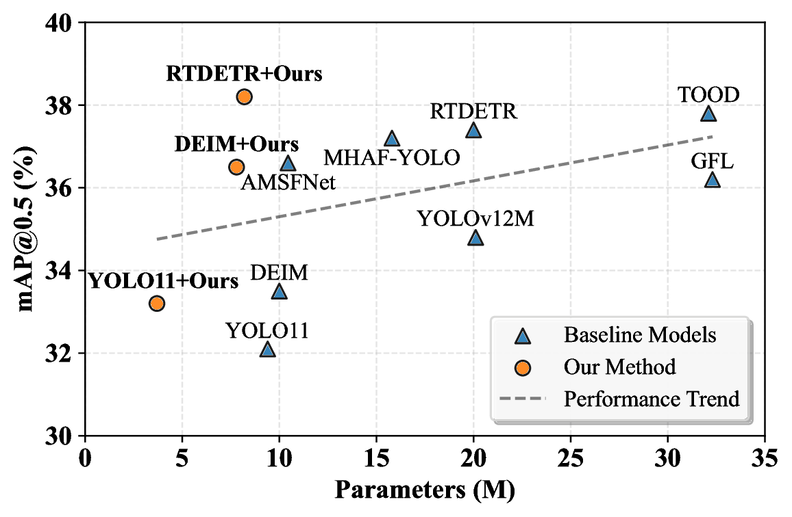

## The cfg file contains the framework files for three different models.

# 

**""**.  
It introduces the **Cross-layer Lightweight Feature Pyramid Network (Cil-FPN)** for remote sensing object detection.

## Abstract

## Contributions

- Propose **Cil-FPN**, a lightweight cross-layer feature pyramid network tailored for remote sensing detection.  
- Introduce **MCFM**, integrating global context pooling with frequency-domain edge enhancement.  
- Achieve superior performance on benchmark datasets while maintaining efficiency.  

## File Structure

## Requirements

## Compilation

